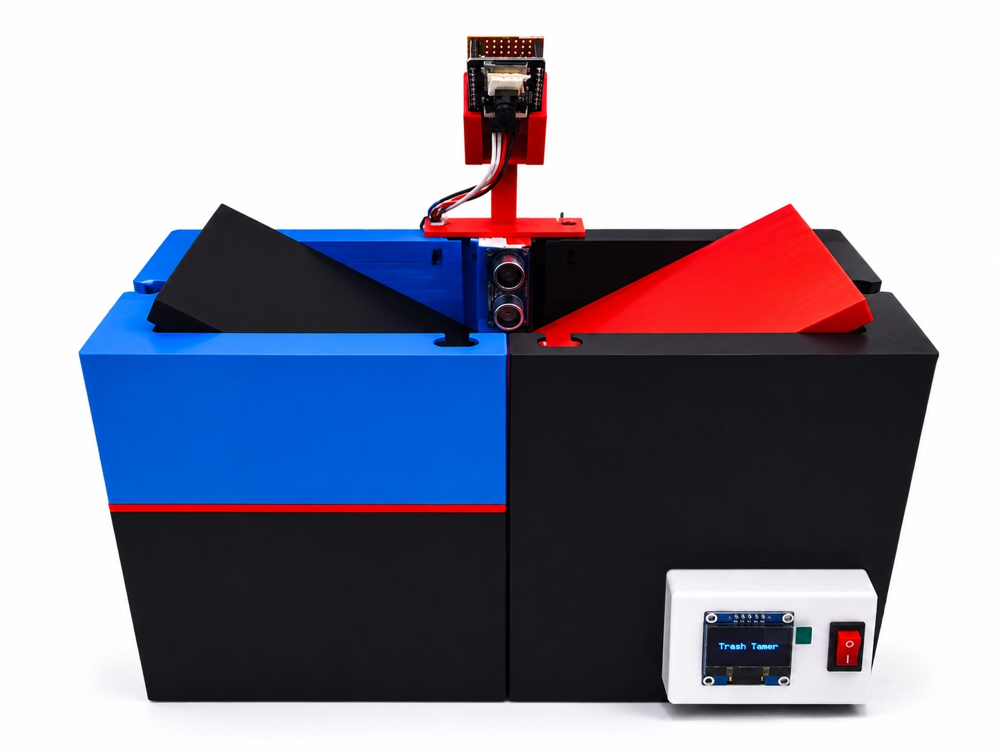
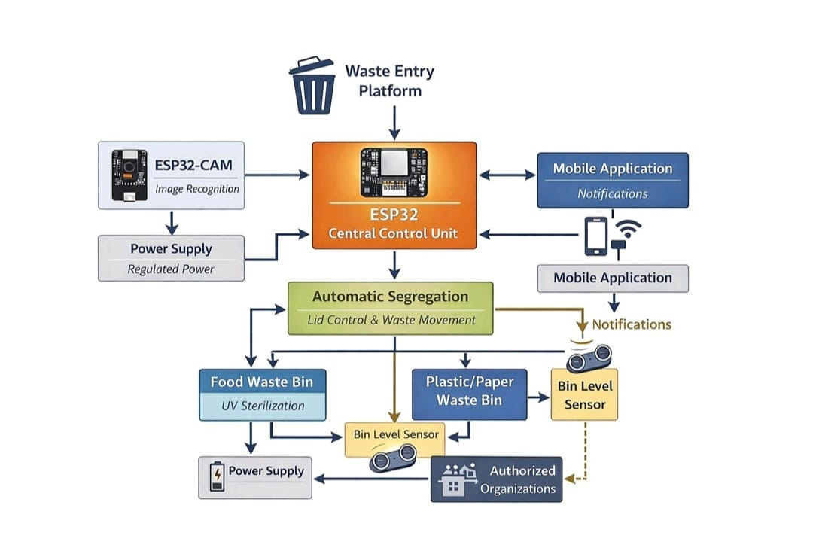
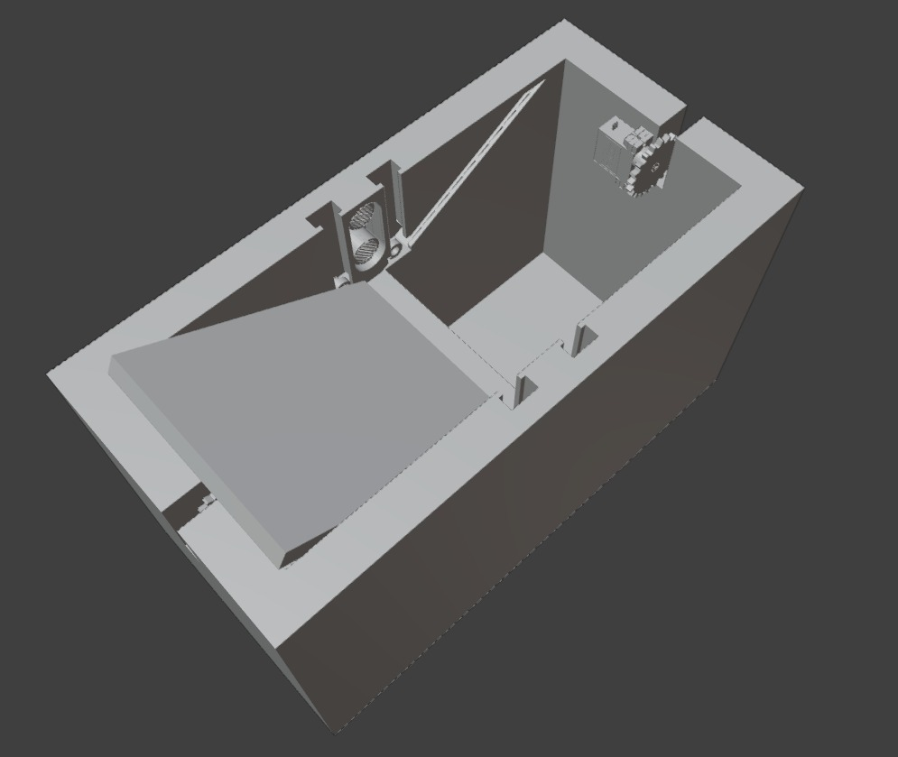
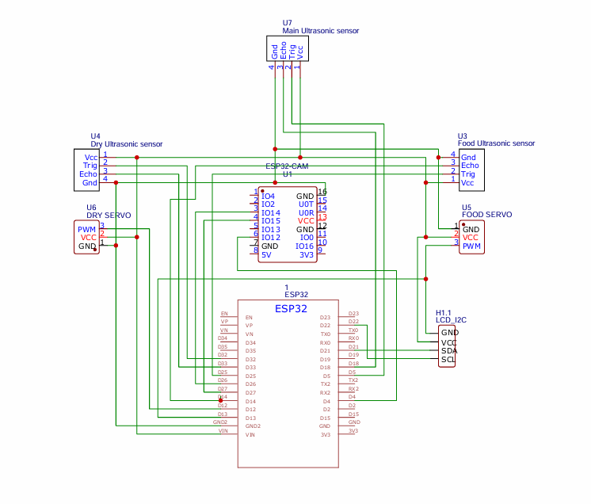
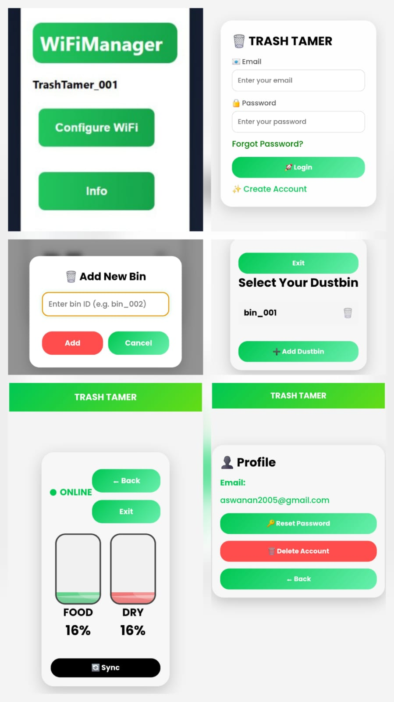

# Trash Tamer Smart Waste Segregation System

  

  <b>AI & IoT Based Smart Waste Segregation System using ESP32 and ESP32-CAM</b>

---

# 📌 Overview

Trash Tamer is an intelligent smart waste segregation system designed to automate the process of separating biodegradable and non-biodegradable waste. The system combines embedded systems, IoT connectivity, image recognition, and automation to improve hygiene and reduce manual waste handling.

The system uses an ESP32-CAM for waste identification, ultrasonic sensors for detection and monitoring, and an MG90S 360° servo motor for automatic waste segregation.

---

# 🚀 Features

- ♻️ Automatic waste segregation
- 📷 ESP32-CAM based image recognition
- 🤖 MG90S 360° servo-controlled sorting mechanism
- 📡 IoT-based monitoring system
- 📱 Mobile/Web dashboard integration
- 📶 WiFiManager configuration support
- 📊 Real-time bin level monitoring
- 🔔 Smart notifications
- 🧼 Hygienic waste management
- 🌱 Promotes sustainable waste disposal

---

# 🛠️ Hardware Components

| Component | Purpose |
|---|---|
| ESP32 | Main controller and IoT communication |
| ESP32-CAM | Image capture and waste identification |
| HC-SR04 Ultrasonic Sensors | Waste detection and bin level monitoring |
| MG90S 360° Servo Motor | Automatic waste segregation |
| OLED Display | Status display |
| Lithium-ion Battery | Portable power supply |
| Connecting Wires | Circuit connections |
| Waste Bin Structure | Physical segregation setup |

---

# ⚙️ Working Principle

1. Waste is placed on the entry platform.
2. Ultrasonic sensor detects waste presence.
3. ESP32-CAM captures the image of the waste.
4. The system classifies waste as:
   - Biodegradable
   - Non-biodegradable
5. MG90S servo motor rotates the segregation platform.
6. Waste is directed into the appropriate bin.
7. Bin levels are monitored continuously.
8. Data is updated to the IoT dashboard.

---

# 📷 Main Product

  

---

# 🔷 Block Diagram

  

---

# 🧩 3D Design Model

  

---

# 🔌 Schematic Diagram

  

---

# 📱 Application Interface

  

---

# 📲 Dashboard Features

- User Authentication
- Add Multiple Dustbins
- Online/Offline Status Monitoring
- Real-time Waste Level Tracking
- Cloud Synchronization
- WiFiManager Integration
- Bin Percentage Visualization

---

# 💻 Technologies Used

- ESP32
- ESP32-CAM
- Arduino IDE
- Embedded C++
- IoT
- Firebase
- WiFiManager
- Ultrasonic Sensors
- Servo Automation

---

# 🌍 Applications

- Smart Homes
- Educational Institutions
- Offices and Workspaces
- Public Waste Collection Systems
- Smart City Solutions

---

# ✅ Benefits

- Reduces manual waste handling
- Improves hygiene conditions
- Enables automatic waste segregation
- Supports environmental sustainability
- Provides smart monitoring
- Reduces waste overflow issues

---

# 🔮 Future Expansion

- 📞 Municipality notification system for automated waste collection alerts
- 🧼 UV sterilization system for improved hygiene and bacterial reduction
- 🌸 Automatic odour control mechanism using fragrance spraying system
- 🐀 Pest deterrence using ultrasonic repellent modules
- ☀️ Solar-powered operation for energy efficiency
- 🤖 Advanced AI-based waste classification
- 📊 Cloud analytics and smart monitoring dashboard
- 🏙️ Integration with smart city infrastructure
- 📱 Dedicated mobile application with real-time notifications

---

# 👨‍💻 Team Members

- Abhinav Krishna P
- Aswana N
- Bliss Shite
- Kaladharan Lal